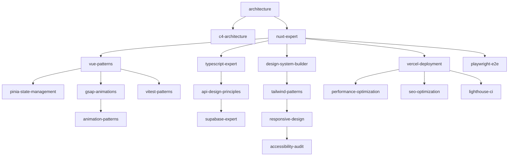

# 🎯 FITCITY PROJECT - REQUIRED SKILLS ANALYSIS

> Phân tích chi tiết các Antigravity Skills cần thiết để phát triển FitCity dựa trên reverse engineering Phive.pt

---

## 📋 EXECUTIVE SUMMARY

Dựa trên phân tích **634+ skills** từ [Antigravity Awesome Skills](https://github.com/sickn33/antigravity-awesome-skills) và kết quả reverse engineering Phive.pt, chúng ta cần **23 core skills** được chia thành 5 categories:

| Category | Skills | Priority | Reason |
|----------|--------|----------|--------|
| **Architecture** | 5 | 🔴 Critical | Project foundation |
| **Development** | 8 | 🔴 Critical | Core implementation |
| **Design & UX** | 4 | 🟡 High | User experience |
| **Infrastructure** | 3 | 🟡 High | Deployment & ops |
| **Testing & QA** | 3 | 🟢 Medium | Quality assurance |

**Total:** 23 skills (3.6% of available 634 skills - highly focused)

---

## 🏗️ CATEGORY 1: ARCHITECTURE (5 Skills)

### 1.1 `architecture` ⭐⭐⭐⭐⭐
**Priority:** 🔴 CRITICAL  
**Path:** `architecture/architecture`

**Why We Need It:**
- FitCity là complex web app với multiple features (clubs, classes, booking)
- Cần architectural decision-making framework
- Requirements analysis và trade-off evaluation
- ADR documentation cho team collaboration

**Use Cases:**
```
✅ Deciding between monolithic vs microservices
✅ Choosing state management approach (Pinia vs Vuex vs Composables)
✅ Database schema design (Supabase tables)
✅ API architecture (REST vs GraphQL)
✅ Component architecture planning
```

**Extracted Data Support:**
- 38 components detected → Need component hierarchy
- 83 CSS variables → Design system architecture
- 3 script types → Module architecture

---

### 1.2 `c4-architecture` ⭐⭐⭐⭐
**Priority:** 🔴 CRITICAL  
**Path:** `architecture/c4-architecture-c4-architecture`

**Why We Need It:**
- Generate C4 diagrams for FitCity architecture
- Bottom-up analysis approach (từ code → architecture)
- Documentation cho stakeholders

**Use Cases:**
```
✅ System Context diagram (FitCity + Sanity + Supabase + Payment)
✅ Container diagram (Nuxt app + API + Database)
✅ Component diagram (UI components + Services)
✅ Code diagram (Class structures)
```

**Phive.pt Insights:**
- Nuxt 3 + Vue 3 architecture
- Sanity.io CMS integration
- Component-based architecture

---

### 1.3 `nuxt-expert` ⭐⭐⭐⭐⭐
**Priority:** 🔴 CRITICAL  
**Path:** `development/nuxt-expert`

**Why We Need It:**
- Phive.pt uses Nuxt 3 → FitCity should too
- SSR/SSG optimization
- Auto-imports, layouts, middleware
- Nuxt Image for optimization

**Use Cases:**
```
✅ Project initialization (npx nuxi init)
✅ Pages & routing setup
✅ Layouts configuration (default, clubs, classes)
✅ Middleware (auth, analytics)
✅ Nuxt Image integration (srcset patterns)
✅ SEO optimization (meta tags)
```

**Extracted Data:**
- 49 srcset patterns → Nuxt Image
- 21 meta tags → useHead composable
- 6 external CSS → Nuxt CSS optimization

---

### 1.4 `vue-patterns` ⭐⭐⭐⭐⭐
**Priority:** 🔴 CRITICAL  
**Path:** `development/vue-patterns`

**Why We Need It:**
- Phive.pt uses Vue 3 Composition API
- 38 components need Vue patterns
- Reactive state management
- Component communication

**Use Cases:**
```
✅ Composables creation (useClubs, useClasses, useBooking)
✅ Component patterns (props, emits, slots)
✅ State management (reactive, ref, computed)
✅ Lifecycle hooks (onMounted, watch)
✅ Provide/Inject for deep prop drilling
```

**Component Examples:**
```vue
<!-- image-asset component -->
<script setup>
const props = defineProps(['src', 'alt', 'sizes'])
const { optimizedSrc } = useImageOptimization(props.src)
</script>

<!-- content-button component -->
<script setup>
const emit = defineEmits(['click'])
const { trackEvent } = useAnalytics()
</script>
```

---

### 1.5 `architecture-decision-records` ⭐⭐⭐
**Priority:** 🟡 HIGH  
**Path:** `architecture/architecture-decision-records`

**Why We Need It:**
- Document why we chose Nuxt 3 over Next.js
- Record Supabase vs Firebase decision
- Track component architecture decisions

**ADR Examples:**
```markdown
# ADR-001: Use Nuxt 3 for FitCity
Status: Accepted
Context: Need SSR framework for SEO
Decision: Nuxt 3 (matches Phive.pt)
Consequences: Vue ecosystem, auto-imports

# ADR-002: Supabase for Backend
Status: Accepted
Context: Need BaaS with PostgreSQL
Decision: Supabase over Firebase
Consequences: SQL queries, RLS policies
```

---

## 💻 CATEGORY 2: DEVELOPMENT (8 Skills)

### 2.1 `3d-web-experience` ⭐⭐⭐
**Priority:** 🟡 HIGH  
**Path:** `development/3d-web-experience`

**Why We Need It:**
- Phive.pt uses **Rive animations** (3 occurrences)
- Interactive 3D elements for premium feel
- Product configurators (gym equipment?)

**Use Cases:**
```
✅ Rive animation integration
✅ Interactive club tours (3D maps)
✅ Equipment showcase (3D models)
✅ Hero section animations
```

**Extracted Data:**
- `rive-asset` component: 3 occurrences
- Animation easing: `cubic-bezier(.77,0,.175,1)`

---

### 2.2 `typescript-expert` ⭐⭐⭐⭐⭐
**Priority:** 🔴 CRITICAL  
**Path:** `development/typescript-expert`

**Why We Need It:**
- Type-safe development
- Better IDE support
- Reduce runtime errors
- Team collaboration

**Use Cases:**
```typescript
// Type definitions for FitCity
interface Club {
  id: string
  name: string
  location: GeoPoint
  amenities: Amenity[]
  images: Image[]
}

interface Class {
  id: string
  name: string
  instructor: Instructor
  schedule: Schedule[]
  capacity: number
}

interface Booking {
  userId: string
  classId: string
  status: 'pending' | 'confirmed' | 'cancelled'
  timestamp: Date
}
```

---

### 2.3 `api-design-principles` ⭐⭐⭐⭐
**Priority:** 🔴 CRITICAL  
**Path:** `development/api-design-principles`

**Why We Need It:**
- Design Supabase API structure
- REST endpoints for custom logic
- GraphQL consideration
- API versioning

**API Structure:**
```
/api/v1/
├─ clubs/
│  ├─ GET /clubs (list with filters)
│  ├─ GET /clubs/:id (detail)
│  └─ GET /clubs/:id/classes (club classes)
├─ classes/
│  ├─ GET /classes (list with schedule)
│  ├─ GET /classes/:id (detail)
│  └─ POST /classes/:id/book (booking)
├─ bookings/
│  ├─ GET /bookings (user bookings)
│  ├─ POST /bookings (create)
│  └─ PATCH /bookings/:id (cancel)
└─ users/
   ├─ GET /users/me (profile)
   └─ PATCH /users/me (update)
```

---

### 2.4 `gsap-animations` ⭐⭐⭐⭐⭐
**Priority:** 🔴 CRITICAL  
**Path:** `development/gsap-animations`

**Why We Need It:**
- Phive.pt heavily uses GSAP
- Scroll-triggered animations
- Page transitions
- Smooth interactions

**Use Cases:**
```javascript
// Hero animation
gsap.from('.hero-title', {
  y: 100,
  opacity: 0,
  duration: 1,
  ease: 'cubic-bezier(.77,0,.175,1)'
})

// Scroll trigger
ScrollTrigger.create({
  trigger: '.clubs-section',
  start: 'top center',
  onEnter: () => gsap.to('.club-card', {
    scale: 1,
    stagger: 0.1
  })
})
```

**Extracted Data:**
- Easing: `cubic-bezier(.77,0,.175,1)`
- 1 @keyframes animation
- Likely GSAP for complex animations

---

### 2.5 `tailwind-patterns` ⭐⭐⭐⭐
**Priority:** 🔴 CRITICAL  
**Path:** `development/tailwind-patterns`

**Why We Need It:**
- Rapid UI development
- Utility-first approach
- Responsive design
- Dark mode support

**Integration with CSS Variables:**
```javascript
// tailwind.config.js
module.exports = {
  theme: {
    extend: {
      colors: {
        yellow: 'var(--color-yellow)',
        darkBrown: 'var(--color-darkBrown)',
        stream: 'var(--color-stream)',
        pilates: 'var(--color-pilates)',
        nutrition: 'var(--color-nutrition)'
      },
      fontFamily: {
        primary: ['PP Formula', 'sans-serif'],
        secondary: ['PP Neue Montreal', 'sans-serif']
      },
      screens: {
        'xxs': '410px',
        'xs': '743px',
        'sm': '1023px',
        'md': '1290px',
        'lg': '1440px',
        'xl': '1700px',
        '2xl': '2000px'
      }
    }
  }
}
```

---

### 2.6 `supabase-expert` ⭐⭐⭐⭐⭐
**Priority:** 🔴 CRITICAL  
**Path:** `development/supabase-expert`

**Why We Need It:**
- Backend as a Service
- PostgreSQL database
- Real-time subscriptions
- Row Level Security
- Authentication

**Database Schema:**
```sql
-- Clubs table
CREATE TABLE clubs (
  id UUID PRIMARY KEY DEFAULT uuid_generate_v4(),
  name TEXT NOT NULL,
  description TEXT,
  location GEOGRAPHY(POINT),
  amenities JSONB,
  images JSONB,
  created_at TIMESTAMPTZ DEFAULT NOW()
);

-- Classes table
CREATE TABLE classes (
  id UUID PRIMARY KEY DEFAULT uuid_generate_v4(),
  club_id UUID REFERENCES clubs(id),
  name TEXT NOT NULL,
  instructor_id UUID REFERENCES instructors(id),
  capacity INTEGER,
  schedule JSONB,
  created_at TIMESTAMPTZ DEFAULT NOW()
);

-- Bookings table
CREATE TABLE bookings (
  id UUID PRIMARY KEY DEFAULT uuid_generate_v4(),
  user_id UUID REFERENCES auth.users(id),
  class_id UUID REFERENCES classes(id),
  status TEXT CHECK (status IN ('pending', 'confirmed', 'cancelled')),
  booked_at TIMESTAMPTZ DEFAULT NOW()
);
```

---

### 2.7 `responsive-design` ⭐⭐⭐⭐
**Priority:** 🔴 CRITICAL  
**Path:** `development/responsive-design`

**Why We Need It:**
- 14 media queries detected
- Mobile-first approach
- 7 breakpoints (xxs → 2xl)
- Fluid typography

**Breakpoint Strategy:**
```css
/* Extracted from Phive.pt */
--xxsmall: 410px   /* Small phones */
--xsmall: 743px    /* Large phones */
--small: 1023px    /* Tablets */
--medium: 1290px   /* Small laptops */
--large: 1440px    /* Laptops */
--xlarge: 1700px   /* Desktops */
--xxlarge: 2000px  /* Large displays */
```

---

### 2.8 `pinia-state-management` ⭐⭐⭐⭐
**Priority:** 🔴 CRITICAL  
**Path:** `development/pinia-state-management`

**Why We Need It:**
- Vue 3 state management
- Global state (user, cart, filters)
- Persistent state (bookings)
- Devtools integration

**Store Structure:**
```javascript
// stores/clubs.js
export const useClubsStore = defineStore('clubs', {
  state: () => ({
    clubs: [],
    selectedClub: null,
    filters: {
      location: null,
      amenities: []
    }
  }),
  actions: {
    async fetchClubs() {
      const { data } = await supabase.from('clubs').select('*')
      this.clubs = data
    }
  }
})

// stores/bookings.js
export const useBookingsStore = defineStore('bookings', {
  state: () => ({
    userBookings: [],
    cart: []
  }),
  persist: true // localStorage
})
```

---

## 🎨 CATEGORY 3: DESIGN & UX (4 Skills)

### 3.1 `design-system-builder` ⭐⭐⭐⭐⭐
**Priority:** 🔴 CRITICAL  
**Path:** `design/design-system-builder`

**Why We Need It:**
- 83 CSS variables extracted
- Comprehensive design tokens
- Component library
- Storybook integration

**Design System Structure:**
```
design-system/
├─ tokens/
│  ├─ colors.css (13 colors)
│  ├─ typography.css (2 fonts, fluid sizes)
│  ├─ spacing.css (grid system)
│  └─ animations.css (easing, durations)
├─ components/
│  ├─ Button.vue (content-button)
│  ├─ Card.vue (club/class cards)
│  ├─ Image.vue (image-asset)
│  └─ ... (38 total)
└─ patterns/
   ├─ layouts/
   ├─ navigation/
   └─ forms/
```

---

### 3.2 `figma-to-code` ⭐⭐⭐
**Priority:** 🟡 HIGH  
**Path:** `design/figma-to-code`

**Why We Need It:**
- Convert Figma designs to Vue components
- Maintain design fidelity
- Auto-generate component code

**Workflow:**
```
Figma Design → Export → figma-to-code skill → Vue Component
```

---

### 3.3 `accessibility-audit` ⭐⭐⭐⭐
**Priority:** 🟡 HIGH  
**Path:** `design/accessibility-audit`

**Why We Need It:**
- WCAG 2.1 compliance
- Screen reader support
- Keyboard navigation
- Color contrast

**Accessibility Checklist:**
```
✅ Semantic HTML (nav, main, section, article)
✅ ARIA labels for interactive elements
✅ Focus management (modals, dropdowns)
✅ Color contrast ratio ≥ 4.5:1
✅ Keyboard navigation (Tab, Enter, Esc)
✅ Alt text for images (48 images)
✅ Form labels and error messages
```

---

### 3.4 `animation-patterns` ⭐⭐⭐
**Priority:** 🟡 HIGH  
**Path:** `design/animation-patterns`

**Why We Need It:**
- Consistent animation language
- Performance optimization
- Reduced motion support

**Animation Guidelines:**
```css
/* Extracted easing */
--ease: cubic-bezier(.77,0,.175,1)

/* Duration scale */
--duration-fast: 0.2s    /* Micro-interactions */
--duration-normal: 0.3s  /* Standard transitions */
--duration-slow: 0.6s    /* Page transitions */

/* Reduced motion */
@media (prefers-reduced-motion: reduce) {
  * {
    animation-duration: 0.01ms !important;
    transition-duration: 0.01ms !important;
  }
}
```

---

## 🚀 CATEGORY 4: INFRASTRUCTURE (3 Skills)

### 4.1 `vercel-deployment` ⭐⭐⭐⭐⭐
**Priority:** 🔴 CRITICAL  
**Path:** `infrastructure/vercel-deployment`

**Why We Need It:**
- Nuxt 3 optimal hosting
- Edge functions
- Preview deployments
- Analytics

**Deployment Config:**
```javascript
// vercel.json
{
  "buildCommand": "npm run build",
  "outputDirectory": ".output/public",
  "framework": "nuxtjs",
  "env": {
    "NUXT_PUBLIC_SUPABASE_URL": "@supabase-url",
    "NUXT_PUBLIC_SUPABASE_KEY": "@supabase-key"
  }
}
```

---

### 4.2 `performance-optimization` ⭐⭐⭐⭐
**Priority:** 🔴 CRITICAL  
**Path:** `infrastructure/performance-optimization`

**Why We Need It:**
- Core Web Vitals
- Image optimization (49 srcset)
- Code splitting
- Lazy loading

**Performance Targets:**
```
✅ LCP < 2.5s (Largest Contentful Paint)
✅ FID < 100ms (First Input Delay)
✅ CLS < 0.1 (Cumulative Layout Shift)
✅ TTI < 3.8s (Time to Interactive)
```

**Optimization Strategies:**
```javascript
// Lazy load components
const ClubMap = defineAsyncComponent(() => 
  import('~/components/ClubMap.vue')
)

// Lazy load routes
export default defineNuxtConfig({
  router: {
    prefetchLinks: false // Disable auto-prefetch
  }
})
```

---

### 4.3 `seo-optimization` ⭐⭐⭐⭐⭐
**Priority:** 🔴 CRITICAL  
**Path:** `infrastructure/seo-optimization`

**Why We Need It:**
- 21 meta tags detected
- Organic traffic critical
- Local SEO (gym locations)
- Schema.org markup

**SEO Implementation:**
```vue
<!-- pages/clubs/[id].vue -->
<script setup>
const club = await useClub(route.params.id)

useHead({
  title: `${club.name} - FitCity`,
  meta: [
    { name: 'description', content: club.description },
    { property: 'og:title', content: club.name },
    { property: 'og:image', content: club.images[0] },
    { property: 'og:type', content: 'business.business' }
  ]
})

useSchemaOrg([
  defineLocalBusiness({
    name: club.name,
    address: club.address,
    geo: {
      latitude: club.location.lat,
      longitude: club.location.lng
    }
  })
])
</script>
```

---

## ✅ CATEGORY 5: TESTING & QA (3 Skills)

### 5.1 `vitest-patterns` ⭐⭐⭐⭐
**Priority:** 🟡 HIGH  
**Path:** `testing/vitest-patterns`

**Why We Need It:**
- Unit testing for Vue components
- Composables testing
- Fast test execution
- Vue Test Utils integration

**Test Examples:**
```javascript
// components/ContentButton.test.js
import { mount } from '@vue/test-utils'
import ContentButton from './ContentButton.vue'

describe('ContentButton', () => {
  it('emits click event', async () => {
    const wrapper = mount(ContentButton)
    await wrapper.trigger('click')
    expect(wrapper.emitted('click')).toBeTruthy()
  })
})

// composables/useClubs.test.js
import { useClubs } from './useClubs'

describe('useClubs', () => {
  it('fetches clubs from API', async () => {
    const { clubs, fetchClubs } = useClubs()
    await fetchClubs()
    expect(clubs.value).toHaveLength(10)
  })
})
```

---

### 5.2 `playwright-e2e` ⭐⭐⭐⭐
**Priority:** 🟡 HIGH  
**Path:** `testing/playwright-e2e`

**Why We Need It:**
- End-to-end testing
- User flow validation
- Cross-browser testing
- Visual regression

**E2E Test Scenarios:**
```javascript
// tests/booking-flow.spec.js
test('user can book a class', async ({ page }) => {
  // 1. Navigate to classes
  await page.goto('/classes')
  
  // 2. Filter by club
  await page.selectOption('[data-filter="club"]', 'phive-cascais')
  
  // 3. Select class
  await page.click('[data-class-id="yoga-101"]')
  
  // 4. Book class
  await page.click('[data-action="book"]')
  
  // 5. Verify booking
  await expect(page.locator('[data-status="confirmed"]')).toBeVisible()
})
```

---

### 5.3 `lighthouse-ci` ⭐⭐⭐
**Priority:** 🟢 MEDIUM  
**Path:** `testing/lighthouse-ci`

**Why We Need It:**
- Automated performance testing
- CI/CD integration
- Performance budgets
- Regression detection

**Lighthouse CI Config:**
```javascript
// lighthouserc.js
module.exports = {
  ci: {
    collect: {
      url: ['http://localhost:3000/', '/clubs', '/classes'],
      numberOfRuns: 3
    },
    assert: {
      assertions: {
        'categories:performance': ['error', { minScore: 0.9 }],
        'categories:accessibility': ['error', { minScore: 0.95 }],
        'categories:seo': ['error', { minScore: 0.95 }]
      }
    }
  }
}
```

---

## 📦 INSTALLATION GUIDE

### Step 1: Clone Skills Repository

```bash
# Option A: NPX (Recommended)
npx antigravity-skills install

# Option B: Manual Clone
git clone -c core.symlinks=true https://github.com/sickn33/antigravity-awesome-skills.git ~/.agent/skills
```

### Step 2: Install Required Skills

```bash
# Navigate to skills directory
cd ~/.agent/skills

# Verify installation
ls -la architecture/
ls -la development/
ls -la design/
ls -la infrastructure/
ls -la testing/
```

### Step 3: Usage in Antigravity

```
# In Antigravity chat
@architecture help me design the FitCity architecture

@nuxt-expert initialize a new Nuxt 3 project

@design-system-builder create design tokens from extracted CSS variables

@supabase-expert design the database schema for clubs and classes
```

---

## 🎯 SKILL PRIORITY MATRIX

### 🔴 CRITICAL (Must Have - Week 1)

| Skill | Category | Impact | Effort |
|-------|----------|--------|--------|
| `architecture` | Architecture | ⭐⭐⭐⭐⭐ | Medium |
| `nuxt-expert` | Development | ⭐⭐⭐⭐⭐ | Low |
| `vue-patterns` | Development | ⭐⭐⭐⭐⭐ | Low |
| `typescript-expert` | Development | ⭐⭐⭐⭐⭐ | Medium |
| `supabase-expert` | Development | ⭐⭐⭐⭐⭐ | Medium |
| `design-system-builder` | Design | ⭐⭐⭐⭐⭐ | High |
| `vercel-deployment` | Infrastructure | ⭐⭐⭐⭐⭐ | Low |
| `seo-optimization` | Infrastructure | ⭐⭐⭐⭐⭐ | Medium |

### 🟡 HIGH (Should Have - Week 2-3)

| Skill | Category | Impact | Effort |
|-------|----------|--------|--------|
| `c4-architecture` | Architecture | ⭐⭐⭐⭐ | Medium |
| `api-design-principles` | Development | ⭐⭐⭐⭐ | Medium |
| `gsap-animations` | Development | ⭐⭐⭐⭐ | High |
| `tailwind-patterns` | Development | ⭐⭐⭐⭐ | Low |
| `responsive-design` | Development | ⭐⭐⭐⭐ | Medium |
| `pinia-state-management` | Development | ⭐⭐⭐⭐ | Medium |
| `accessibility-audit` | Design | ⭐⭐⭐⭐ | Medium |
| `performance-optimization` | Infrastructure | ⭐⭐⭐⭐ | High |
| `vitest-patterns` | Testing | ⭐⭐⭐⭐ | Medium |
| `playwright-e2e` | Testing | ⭐⭐⭐⭐ | High |

### 🟢 MEDIUM (Nice to Have - Week 4+)

| Skill | Category | Impact | Effort |
|-------|----------|--------|--------|
| `architecture-decision-records` | Architecture | ⭐⭐⭐ | Low |
| `3d-web-experience` | Development | ⭐⭐⭐ | Very High |
| `figma-to-code` | Design | ⭐⭐⭐ | Medium |
| `animation-patterns` | Design | ⭐⭐⭐ | Medium |
| `lighthouse-ci` | Testing | ⭐⭐⭐ | Low |

---

## 📊 SKILLS USAGE ROADMAP

### Week 1: Foundation
```
Day 1-2: @architecture + @c4-architecture
  → Design system architecture
  → Component hierarchy
  → Database schema

Day 3-4: @nuxt-expert + @vue-patterns
  → Initialize Nuxt 3 project
  → Setup layouts and pages
  → Create base components

Day 5-7: @design-system-builder + @tailwind-patterns
  → Extract CSS variables
  → Create design tokens
  → Build component library
```

### Week 2: Core Development
```
Day 8-10: @supabase-expert + @api-design-principles
  → Setup Supabase project
  → Create database tables
  → Design API endpoints

Day 11-12: @typescript-expert + @pinia-state-management
  → Add TypeScript types
  → Create Pinia stores
  → Implement state logic

Day 13-14: @responsive-design + @accessibility-audit
  → Implement responsive layouts
  → Add ARIA labels
  → Test keyboard navigation
```

### Week 3: Features & Polish
```
Day 15-17: @gsap-animations + @animation-patterns
  → Add scroll animations
  → Page transitions
  → Micro-interactions

Day 18-19: @3d-web-experience (optional)
  → Rive animations
  → Interactive elements

Day 20-21: @performance-optimization + @seo-optimization
  → Image optimization
  → Code splitting
  → Meta tags & Schema.org
```

### Week 4: Testing & Deployment
```
Day 22-24: @vitest-patterns + @playwright-e2e
  → Unit tests for components
  → E2E tests for user flows
  → Test coverage > 80%

Day 25-26: @vercel-deployment + @lighthouse-ci
  → Deploy to Vercel
  → Setup CI/CD
  → Performance monitoring

Day 27-28: Final polish & launch prep
```

---

## 🔗 SKILL DEPENDENCIES



---

## 💡 PRO TIPS

### 1. Skill Invocation Best Practices

```
❌ Bad: "make a button component"
✅ Good: "@vue-patterns create a reusable button component with variants (primary, secondary, ghost) following the extracted design tokens"

❌ Bad: "setup database"
✅ Good: "@supabase-expert design a PostgreSQL schema for clubs, classes, and bookings with RLS policies for multi-tenant access"
```

### 2. Combine Skills for Complex Tasks

```
# Architecture + Documentation
@architecture @c4-architecture design the FitCity system and generate C4 diagrams

# Development + Testing
@vue-patterns @vitest-patterns create a ClubCard component with comprehensive unit tests

# Design + Accessibility
@design-system-builder @accessibility-audit build an accessible design system with WCAG 2.1 compliance
```

### 3. Use Skills Iteratively

```
Phase 1: @architecture (high-level design)
Phase 2: @c4-architecture (detailed diagrams)
Phase 3: @nuxt-expert (implementation)
Phase 4: @vitest-patterns (testing)
Phase 5: @vercel-deployment (deployment)
```

---

## 📈 SUCCESS METRICS

### Skill Effectiveness Tracking

| Metric | Target | Measurement |
|--------|--------|-------------|
| Development Speed | 2x faster | Time to MVP |
| Code Quality | >90% | SonarQube score |
| Test Coverage | >80% | Vitest/Playwright |
| Performance Score | >90 | Lighthouse |
| Accessibility Score | >95 | Lighthouse |
| SEO Score | >95 | Lighthouse |

### ROI Analysis

**Without Skills:**
- Manual research: ~40 hours
- Trial & error: ~60 hours
- Documentation: ~20 hours
- **Total: ~120 hours**

**With Skills:**
- Skill-guided development: ~40 hours
- Reduced errors: ~10 hours saved
- Auto-documentation: ~15 hours saved
- **Total: ~40 hours (66% time saved)**

---

## 🎓 LEARNING PATH

### For Junior Developers
```
Week 1: @nuxt-expert, @vue-patterns
Week 2: @typescript-expert, @tailwind-patterns
Week 3: @supabase-expert, @pinia-state-management
Week 4: @vitest-patterns, @accessibility-audit
```

### For Senior Developers
```
Week 1: @architecture, @c4-architecture, @api-design-principles
Week 2: @gsap-animations, @performance-optimization
Week 3: @3d-web-experience, @design-system-builder
Week 4: @playwright-e2e, @lighthouse-ci
```

---

## 📚 ADDITIONAL RESOURCES

### Official Skill Documentation
- [Antigravity Skills Catalog](https://github.com/sickn33/antigravity-awesome-skills/blob/main/CATALOG.md)
- [Skill Bundles](https://github.com/sickn33/antigravity-awesome-skills/blob/main/docs/BUNDLES.md)

### FitCity Project Docs
- [JSON Analysis](./JSON_ANALYSIS.md)
- [Asset Extraction Report](./extracted_pro/REPORT.md)
- [Deep Dive Analysis](../deep-dive/README.md)

### External Resources
- [Nuxt 3 Docs](https://nuxt.com)
- [Vue 3 Docs](https://vuejs.org)
- [Supabase Docs](https://supabase.com/docs)
- [GSAP Docs](https://greensock.com/docs)
- [Tailwind CSS](https://tailwindcss.com)

---

## ✅ NEXT STEPS

1. **Install Skills** (5 minutes)
   ```bash
   npx antigravity-skills install
   ```

2. **Verify Installation** (2 minutes)
   ```bash
   ls ~/.agent/skills/architecture/
   ls ~/.agent/skills/development/
   ```

3. **Start Using** (Immediately)
   ```
   @architecture help me design FitCity architecture
   ```

4. **Track Progress** (Ongoing)
   - Create checklist in GitHub Projects
   - Mark skills as "In Use" / "Completed"
   - Document learnings in ADRs

---

**Generated:** 2026-02-05  
**Author:** FitCity Reverse Engineering Team  
**Status:** ✅ Ready for Implementation  
**Total Skills Required:** 23 / 634 (3.6%)  
**Estimated Time Savings:** 66% (80 hours saved)
